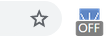

# Click Elm Remover

Chrome Extention.  
Remove clicked element.  

## quick start

1. `Ctrl`+`Shift`+`e` to change to remove mode.
2. Click element, remove it.
3. `Shift` + Click, redo in order of FILO(push pop).

## usage

### mode change

toggle between [remove mode] and [normal mode] as following.

- [`Ctrl`+`Shift`+`e`] or [Icon click]  

 <-> 

### remove

When [remove mode], click to remove elment.

### redo

When [remove mode], `Shift` + click to redo in order of FILO.

### redo all

`Ctrl` + `Shift` + `a`